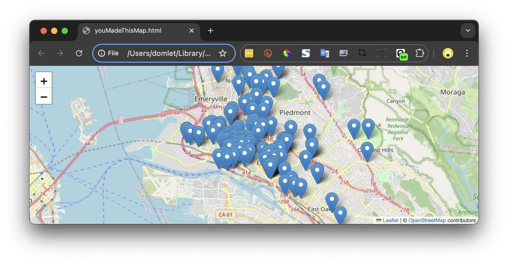

# Add points to a map (using CSV file)
[](https://domlet.github.io/oakland-map-landmarks/)

I found a list of [145 Designated Landmarks in the city of Oakland California](https://www.oaklandca.gov/topics/list-of-designated-landmarks), and I wanted to see how many of them were buildings with Black or non-white architects, since Oakland is historically known as a [Chocolate City](https://en.wikipedia.org/wiki/Chocolate_City_speech#:~:text=In%20African%20American%20culture%2C%20the,or%20African%20American%20political%20leadership.). I also wanted to the landmarks on a map so I could understand where they were geographically located. This project solves the 2nd problem.

I just wanted to "put dots on a map" so I asked ChatGPT what the easiest solution would be. It replied with a Python solution and I got it working in a few hours. I wasted some time wrestling with multiple Python environments on my system and finally just used a virtual environment. Instructions on how to do that below.

## View the map

See the [live map here](https://domlet.github.io/oakland-map-landmarks/).

## Make your own map

If you want to map your own locations, here's how to do it:

1. Download this repository to your computer.

1. On your local version, replace the data in the  `data.csv` file with your own values. (Don't change the header row.) 

1. On your command line, navigate to the folder.

1. On your command line, use this command: `python3 map.py`

 **Note:** If you experience a `ModuleNotFoundError` error, follow the Virtual Environment instructions below before you follow the steps in this section. 

1. When you execute the python script, it will generate a file called `youMadeThisMap.html` which you can double click on to see your map. It will open in a web browser. 

1. If you made a mistake and you want to generate a new html file, delete the `youMadeThisMap.html` file and run the python script again. It will generate a new file.


### Virtual Environment

Below are instructions to create the virtual environment. Video here.

1. Create a Virtual Environment:

	```
	python3.12 -m venv myenv
	
	```

1. Activate the Virtual Environment:

	```
	source myenv/bin/activate
	```

1. Upgrade pip within the Virtual Environment:

	```
	python -m pip install --upgrade pip
	```

1. Install Other Packages as Needed:

	```
	pip install pandas folium
	```

1. Run the python file:

	```
	python3 map.py
	```
	

## Related project (CCPA Alumni Map)
If you're interested in a more intricate map, see my [CCPA Alumni Map](https://github.com/domlet/alumni-map/), which uses JavaScript and MapboxGL to map data from several Google Sheets that publish to live CSV file. It's a wonderful solution for a more customized and interactive map application (that automatically updates when anyone completes a Google Form that adds a new row to a Google Sheet).